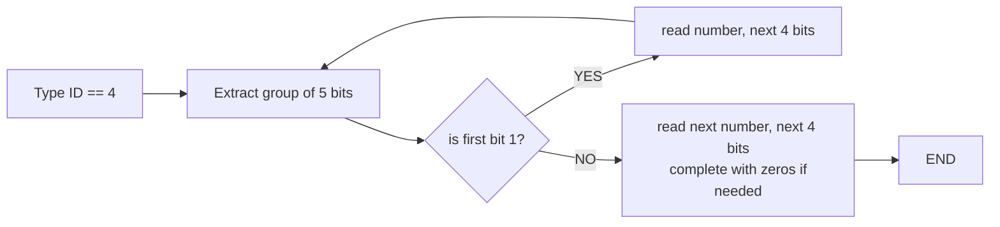
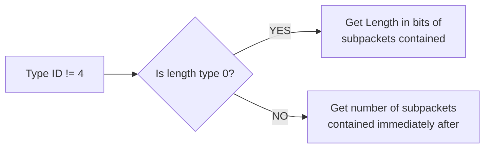
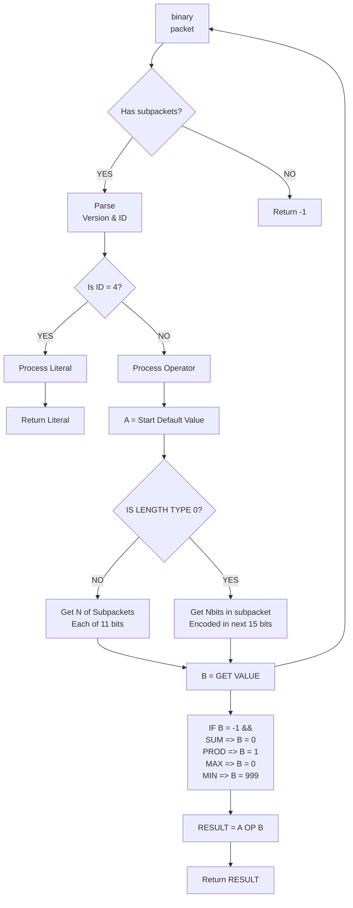

<!-- The description of the parsing for day16 is quite long and condition dependent so
I decided to make a summary and some diagrams to help elucidate the best solution -->

### Rules

1. The hexadecimal representation of this packet **might** encode a few extra $0$ bits at the end that should be ignored.
2. Every packet has a standard header: **first three bits** encode the packet **version** and the **next three bits** the **packet type ID**.
3. **Literal values** are packets with **type ID** $4$. The content of literal value can be represented by groups of five bits, one containing the prefix and the other the number value.

4. **Operators** are packets with **type ID** $\neq 4$. An operator can contain one or more packets. The header of an operator is followed by the **length type ID**. If the length type ID is $15$ it represents the **total lenght in bits** of the sub-packets contained by this packet. If $1$, then it represents the **number of sub-packets immediately contained** by this packet.

### Second Part

- The flow diagram when one needs to consider the operations is as follows:

