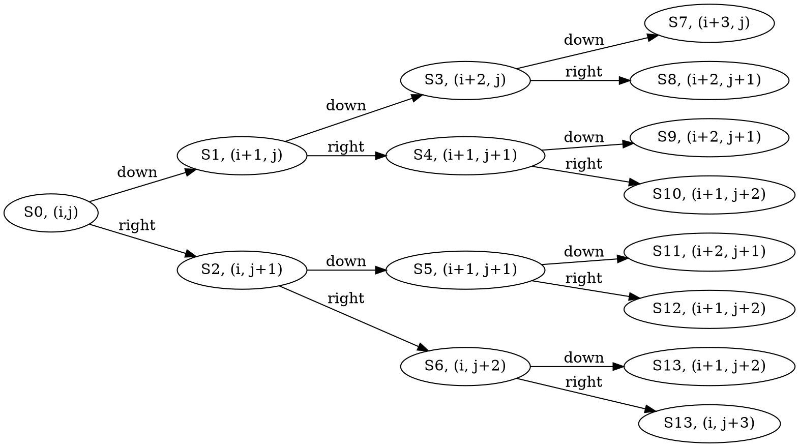

### Assumptions:
1. We navigate from top left towards bottom right
2. Every step is either to the right or down
- Consequence of this is that the total number of steps is equal to:
$$steps = n\_rows + n\_cols - 2$$
- The number 2 takes into account the fact the already start at the top left and we have already one step down and right into the risk map (input data)

### Methodology
1. We will create a function that takes the previous cumulative risk and position and wil returns two new risk values given by the outcome of whether one steps to the right or to down. Given that $i$ represents the row index and $j$ the column index, then:

- The above function should contemplate the edge cases that occur whenever we reach $i=n\_cols$ and/or $j=n\_rows$.
#### Challenges
- Exploring all the possible paths under assumptions \#1 and \#2, means that the whole tree will have $2^{steps}$.
  - For example for $steps=18$ example given on has a total of paths: $262144$
  - For part 1 one has $steps=198$ with total of paths: $401734511064747568885490523085290650630550748445698208825344$
- So _we need to keep track of the cumulative sums but not keep track of the whole binary tree values_.

2. From the above challenge will then need to adjust the recursive function such we explore "enough further ahead".
- Taking only three steps ahead, we will have 8 possible paths
```python
def next_sum(i, j, current_sum, steps):
  if steps == 0:
  right_sum = current_sum + map(i, j+1)
  left_sum = current_sum + map(i+1, j)
  return (right_sum, down_sum)
```

```python
def factorial(S):
  if S == 1:
    return 1
  else:
    return S * factorial(S - 1)
```
